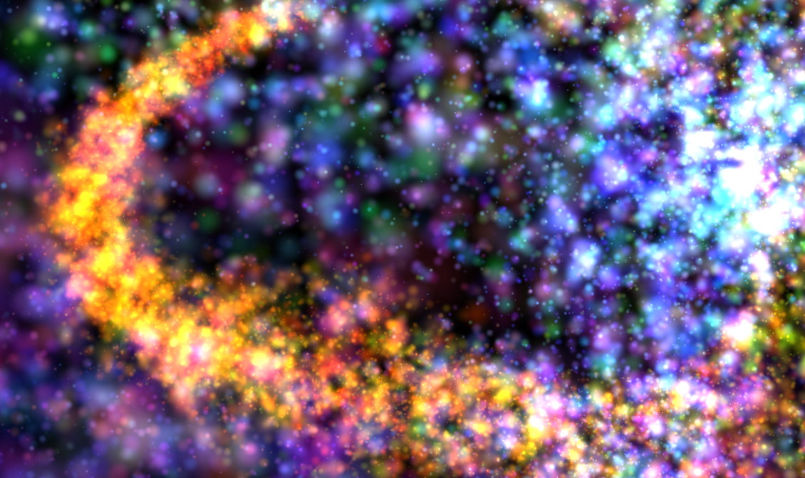

# Synthgen Particles (Windows version)

 This is a demo of my own GPU particle system technique written in C++ and OpenGL 3.0. It also has a simple procedural music inside.

## Getting started

There is a prebuilt 4k intro binary in the bin folder that you can run right away. Before you do so, see [Controls](#Controls) section below.

In order to build the code, open the repository root as a CMake project using Visual Studio 2019. Visual Studio 2017 will probably work too. There are no dependencies required to make a normal build of the project. To build a 4 KB version you have to download Crinkler and put its executable into the `bin/` folder.

Since this demo is designed to fit in a 4 KB executable, the code is a bit hacky and can't follow some best practices for C++ and OpenGL. In particular, it contains a lot of platform-specific code, uses global variables, legacy OpenGL features, and unsafe C-style string functions to reduce the generated code size.

# Controls
 This demo supports control of various particle system parameters:

-  Keys **1-9**: number of particles
-  **Shift & Ctrl**: time speed
- **Left & Right** arrows: change the time direction
- **Up & Down** arrows: when pressed speeds up (x5) the animation in forward or backward direction respectively
- **P** - pause or resume
- **I** - restart the particle system
- **Esc** - exit

## How it works

Unlike most existing methods, my technique doesn't do any step by step simulation. Instead, particle trajectory, size, color and other parameters are defined as functions of time. The absolute time is also used to figure out which particles are alive and when they were born. So this implementation allows for time travel or controlling its speed by changing the absolute time variable accordingly.

Most of the work is done in a vertex shader. Its template is hard-coded in `shader.h`. Particle trajectory, color and other formulas are moved into `demo.cpp` to allow creation of multiple different particle systems from a single shader template, although this capability isn't used by the demo now.

This method is the only way I know to simulate particles on the GPU that can be implemented in unextended OpenGL ES 2.0. For example, it works with Mali 400 GPU which has no support for vertex textures, PBO, transform feedback or compute shaders.

## Versions for other platforms

- [WebGL](https://devoln.github.io/particles) - almost the same features, no music

- [Android](https://play.google.com/store/apps/details?id=com.gammaker.synthgenparticles) - the most advanced version (better optimization, camera control, live wallpaper, no music)